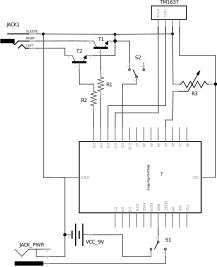

# Timelapse shutter for Fuji HS25 EXR
Intervalometer for Fuji HS25 EXR camera (or any other compatible with JJC RR-80) utilizing external signals to trigger autofocus and shutter.

# Operation
When powered up, user selects a time interval and switches the module to `working` mode. At the end of the countdown, focus pin is grounded, waits for a moment to allow the camera to complete autofocus, then grounds the trigger pin to take a photo.

Needs JJC RR-80 cable to interface miniUSB with 2.5mm jack. Alternatively, the cable can be soldered at home using schema available on [doc-diy: Camera remote release pinout list](http://www.doc-diy.net/photo/remote_pinout/index.php)

# Schema

## Power
Can be powered from 9V battery or external power source (like powerbank). `S1` switch is selects which is used. Arduino `RAW` input is used as a voltage regulator allowing power from 3.4 V to 12 V.

## User interface
- `S2` switch - allows user to switch operating modes between following:
  - `setup` - countdown stopped, timer selection
  - `working` - countdown ongoing, controlling focus and trigger

- `R3` potentiometer - used to select time presets when in `setup` mode

- `TM1637` 4 digit segment display to provide info to user
  - ##00 = (photos taken) `mod` 100
  - 00#0 - 10 sec countdown till next photo
  - 000# - mode selection
    - 0 = 5 sec
    - 1 = 10 sec
    - 2 = 30 sec
    - 3 = 1 min
    - 4 = 2 min
    - 5 = 3 min
    - 6 = 4 min
    - 7 = 5 min

